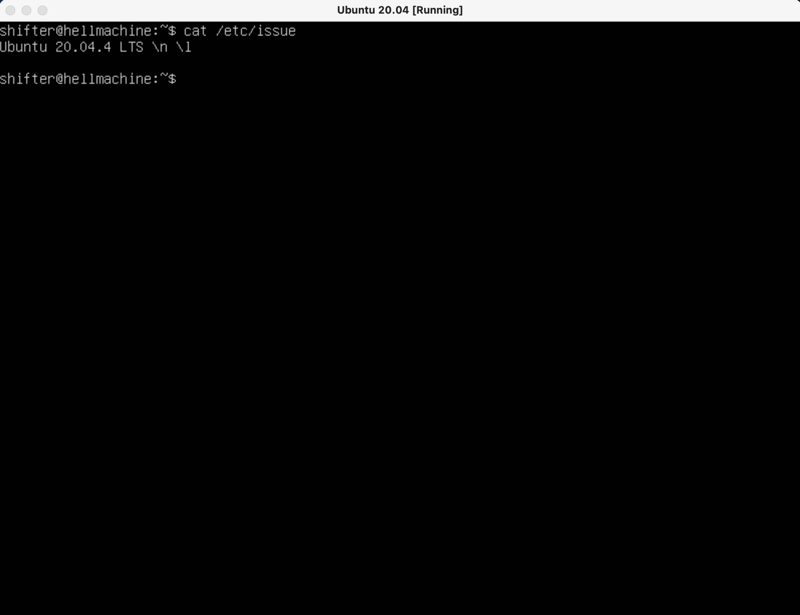
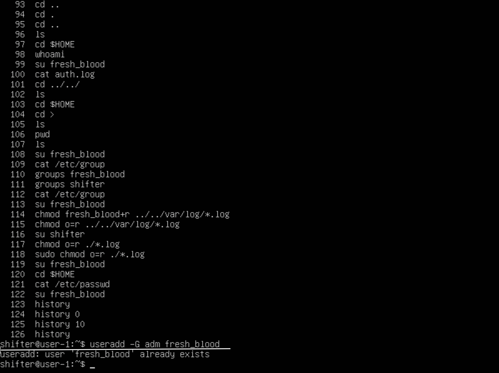
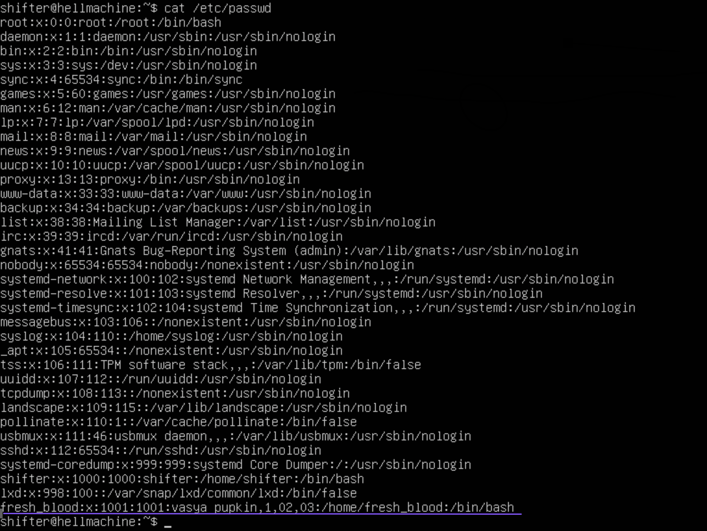

## Part 1. Install OS

>Скрин выполнения - `cat /etc/issue`.

## Part 2. Create user
- Флаг -G добавляет созданного пользователь в группу **adm**.

- Вывод команды `cat /etc/passwd`

part 3
	1. Изменил имя хоста в файле /etc/hostname на user-1
	1. С помощью команды timedatectl вывел информацию о часовых поясах
	2. С помощью команды timedatectl set-timezone Europe/Moscow поменял часовой пояс
	3. С помощью команды ip link show вывел названия сетевых интерфейсов

	lo - Виртуальный интерфейс который по умолчанию встроен в любую линукс систе	му.
Он используется для отладки сетевых программ и запуска серверных приложений на локальной машине.
С этим интерфейсом всегда связан адрес 127.0.0.1. У него есть dns-имя – localhost. Посмотреть привязку можно в файле /etc/hosts.
	4. С помощью команды ip a show получил динамический ip адрес от DHCP
	
	DHCP (Dynamic Host Configuration Protocol) - протокол динамической настройки узла. Прикладной протокол позволяющий автоматически получать ip адреса, работает по модели клиент-сервер. На этапе конфигурации сетевого устройства сервер выдает ip адрес клиенту.
	5. Выставил статические настройки сети(ip, gw, dns) в файле /etc/netplan/00-installer-config.yaml
	6. После ребута системы прорерил статические настройки и пропинговал серверы 1.1.1.1 & ya.ru
part 4

Обновил систему двумя командами 
	1. sudo apt update обновление репозиториев ubuntu
	2. sudo apt full-upgrade "Умное" обновление установленных пакетов, умнись заключается в приоритетной установке, если какие то пакеты будут конфликтовать друг с другом, то в этом случае будет установлен более приоритетный пакет.
	screen 4 upgrade sys

Part 5
	Sudo - утилита позволяющая выполнять команды из под любого пользователя, без фактического входа в учетную запись, по умолчанию команды выполняются с правами суперпользователя root.
	screen 5 new_hostname

Part 6
	Почитал про NTP, у меня он уже был активирован.
	screen 6 synch time
Part 7
	Vim для сохранения ввел команду :qw
	vim_txt.png
	Nano для сохранения ^X, y
	nano_txt.png
	Joe для сохранения Ctrl+K, y
	joe_txt.png

	Vim без сохранения ввел команду :q!
	vim_txt.png
	Nano без сохранения ^X, n
	nano_txt.png
	Joe без сохранения Ctrl+K, n
	joe_txt.png

	Joe поиск ^K, f, change_word, r(replace), new word
	Vim %s/word/new_word/g
	Nano ^\ -> word -> new_word -> y

Part 8 
	sudo apt-get install ssh
	sudo systemctl enable ssh добавил в автозагрузку
	sudo vim /etc/ssh/sshd_config изменил в файле значение порта на 2022
	ps -A | grep ssh (-A) - выводит все запущенные процессы
	Команда **netstat** - инструмент для мониторинга сетей TCP / IP, который может отображать таблицы маршрутизации, фактические сетевые подключения и информацию о состоянии каждого устройства сетевого интерфейса. Ключ **-t** отбражает порты протокола _TCP_, **-a** выводит все соединения, **-n** использует при выводе IP-адрес напрямую, а не через сервер доменных имен.
	Значения столбцов:
- **Proto**: протокол, используемый сокетом.
- **Recv-Q**: количество байтов, не скопированных пользовательской программой, подключенной к этому сокету.
- **Send-Q**: количество неподтвержденных байтов удаленного хоста.
- **Local Address**: локальный адрес (имя локального хоста) и номер порта сокета. Если не указана опция -n, адрес сокета разрешается в соответствии с полным именем хоста (FQDN), а номер порта преобразуется в соответствующее имя службы.
- **State**: состояние сокета. 
- **Foreign Address**: удаленный адрес (имя удаленного хоста) и номер порта сокета.
- **0.0.0.0** означает, что никто не подключен, все соединения **LISTENING** имеют внешний адрес **0.0.0.0**.

Part 9
	uptime 9 min 
	авторизован 1 пользователь
	средняя загрузка 1, 5, 15 минут соответственно 0,00 0,03 0,03
	общее количество процессов 97
	загруженность CPU
		us - 0 (пользовательские процессы)
		sy - 0 (системные процессы)
		id - 100 (неиспользованные ресурсы)
		wa - 0 (операции ввода/вывода (дисковые операции))
	загруженность памяти
		total - 3932 mb (общий объем)
		free - 3383 mb (свободно)
		used - 148 mb
	pid процесса занимающего больше всего памяти
		PID - 660; mem 1.0%;
	pid процесса, занимающего больше всего процессорного времени
		PID - 1; cpu 0.0;

Part 10
	Название hdd /dev/sda/
	Model box hard disk
	Размер 10 Gb, 20791565 sectors
	swap - 0 b

Part 11 
	Размер корневого раздела / 9336140
	Used 3121172, 36%
	Available 5720992 
	Еденица измерения 1 kb

	df -Th
	Size 9.0 GB
	Used 3.0 GB 36%
	Available 5.5 GB
	filesystem type ext4

Part 12
	home 120 Kb
	var 748 Mb
	var/log 45 Mb

Part 13	
	Время последнего успешного логина в систему 22:21:49, залогинился shifter, метод входа systemd-logind 

				
