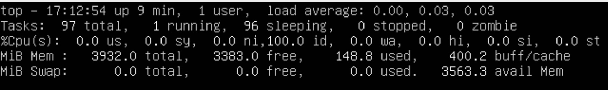

## Part 1. Install OS

>Скрин выполнения - `cat /etc/issue`.

## Part 2. Create user
- Флаг -G добавляет созданного пользователь в группу **adm**.

- Вывод команды `cat /etc/passwd`

## Part 3. Network settings
#### Изменил имя хоста в файле /etc/hostname на user-1

#### C помощью команды timedatectl вывел информацию о часовых поясах

#### С помощью команды timedatectl set-timezone Europe/Moscow поменял часовой пояс

#### С помощью команды ip link show вывел названия сетевых интерфейсов

	

	lo - Виртуальный интерфейс который по умолчанию встроен в любую линукс систему. Он используется для отладки сетевых программ и запуска серверных приложений на локальной машине. С этим интерфейсом всегда связан адрес 127.0.0.1. У него есть dns-имя – localhost. Посмотреть привязку можно в файле /etc/hosts.

#### С помощью команды ip a show получил динамический ip адрес от DHCP

	DHCP (Dynamic Host Configuration Protocol) - протокол динамической настройки узла. Прикладной протокол позволяющий автоматически получать ip адреса, работает по модели клиент-сервер. На этапе конфигурации сетевого устройства сервер выдает ip адрес клиенту.

#### Выставил статические настройки сети(ip, gw, dns) в файле /etc/netplan/00-installer-config.yaml

#### После ребута системы прорерил статические настройки и пропинговал серверы 1.1.1.1 & ya.ru

## Part 4. Update OS.

#### Обновил систему двумя командами
- `sudo apt update` - обновление репозиториев ubuntu.
- `sudo apt full-upgrade` - "Умное" обновление установленных пакетов, умнись заключается в приоритетной установке, если какие то пакеты будут конфликтовать друг с другом, то в этом случае будет установлен более приоритетный пакет.

    

## Part 5. Sudo.

- Sudo - утилита позволяющая выполнять команды из под любого пользователя, без фактического входа в учетную запись, по умолчанию команды выполняются с правами суперпользователя root.

## Part 6. Setup and setting time services.

- Почитал про NTP, у меня он уже был активирован.

## Part 7. Installing and using text editors.

#### Vim для сохранения ввел команду :qw

#### Nano для сохранения ^X, y

#### Joe для сохранения Ctrl+K, y

#### Vim без сохранения ввел команду :q!

#### Nano без сохранения ^X, n

#### Joe без сохранения Ctrl+K, n

#### Joe поиск ^K, f, change_word, r(replace), new word

#### Vim %s/word/new_word/g

#### Nano ^\ -> word -> new_word -> y

## Part 8. Installing and basic settings sshd.

`sudo apt-get install ssh`
- `sudo systemctl enable ssh` -  добавил в автозагрузку.
- `sudo vim /etc/ssh/sshd_config` - изменил в файле значение порта на 2022.

- `ps -A | grep ssh`
- (-A) - выводит все запущенные процессы.

- Команда **netstat** - инструмент для мониторинга сетей TCP / IP, который может отображать таблицы маршрутизации, фактические сетевые подключения и информацию о состоянии каждого устройства сетевого интерфейса. Ключ **-t** отбражает порты протокола _TCP_, **-a** выводит все соединения, **-n** использует при выводе IP-адрес напрямую, а не через сервер доменных имен.

	Значения столбцов:
- **Proto**: протокол, используемый сокетом.
- **Recv-Q**: количество байтов, не скопированных пользовательской программой, подключенной к этому сокету.
- **Send-Q**: количество неподтвержденных байтов удаленного хоста.
- **Local Address**: локальный адрес (имя локального хоста) и номер порта сокета. Если не указана опция -n, адрес сокета разрешается в соответствии с полным именем хоста (FQDN), а номер порта преобразуется в соответствующее имя службы.
- **State**: состояние сокета. 
- **Foreign Address**: удаленный адрес (имя удаленного хоста) и номер порта сокета.
- **0.0.0.0** означает, что никто не подключен, все соединения **LISTENING** имеют внешний адрес **0.0.0.0**.

## Part 9. Installing and using top and htop.

- **Uptime** - 9 min.
- Авторизован **1** пользователь.
- Средняя загрузка **1, 5, 15** минут соответственно **0,00 0,03 0,03**.
- Общее количество процессов **97**.
- Загруженность CPU:
	us - 0 (пользовательские процессы)
	sy - 0 (системные процессы)
	id - 100 (неиспользованные ресурсы)
	wa - 0 (операции ввода/вывода (дисковые операции))
- Загруженность памяти
	total - 3932 mb (общий объем)
	free - 3383 mb (свободно)
	used - 148 mb
- PID процесса занимающего больше всего памяти
	PID - 660; mem 1.0%;
	pid процесса, занимающего больше всего процессорного времени
	PID - 1; cpu 0.0;

## Part 10. fdisk
- Name `hdd /dev/sda/`
- Model `box hard disk`
- Size `10 Gb, 20791565 sectors`
- Swap - 0 b

## Part 11. df
- Размер корневого раздела / **9336140 sectors**
- Used **3121172, 36%**
- Available **5720992**
- Еденица измерения 1 kb

#### df -Th
- Size **9.0GB**
- Used **3.0GB, 36%**
- Available **5.5GB**
- filesystem type **ext4**

## Part 12. du

#### home 
- 120 Kb

#### var
- 748 Mb

	
#### var/log
- 45 Mb

#### var/log each

## Part 13. ncdu

#### home 

#### var

	
#### var/log

## Part 14. system journal.
- Время последнего успешного логина в систему **22:21:49**, залогинился **shifter**, метод входа **systemd-logind**.

## Part 15. Cron.

			
